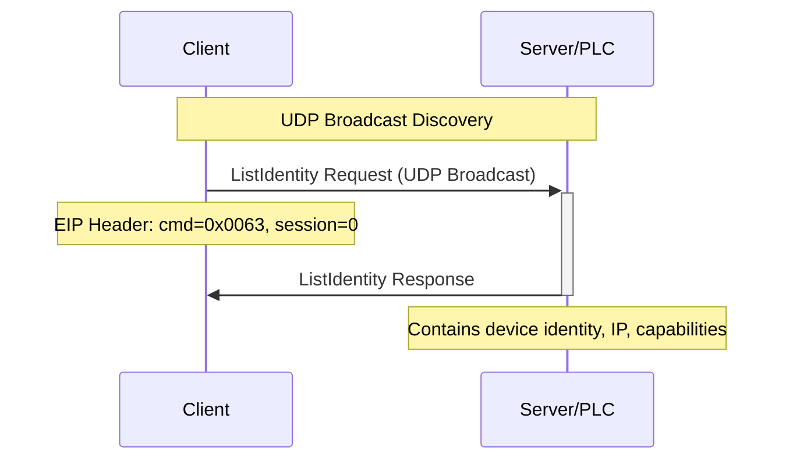
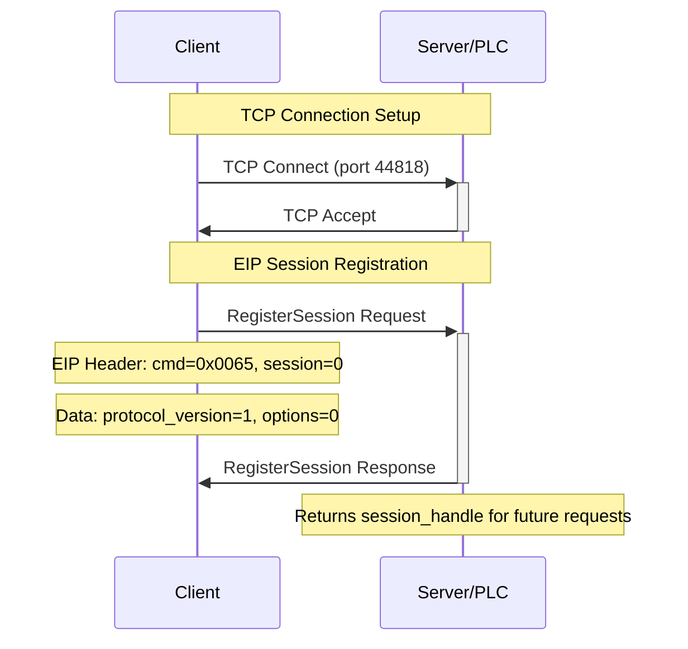
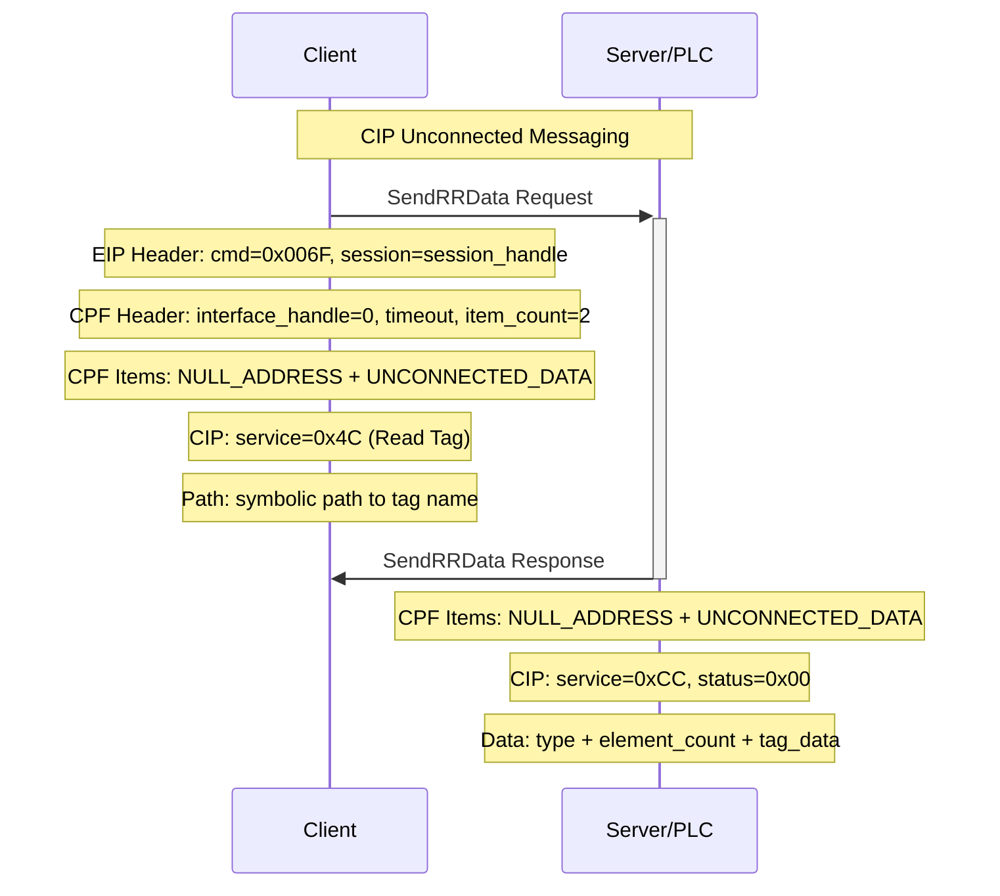
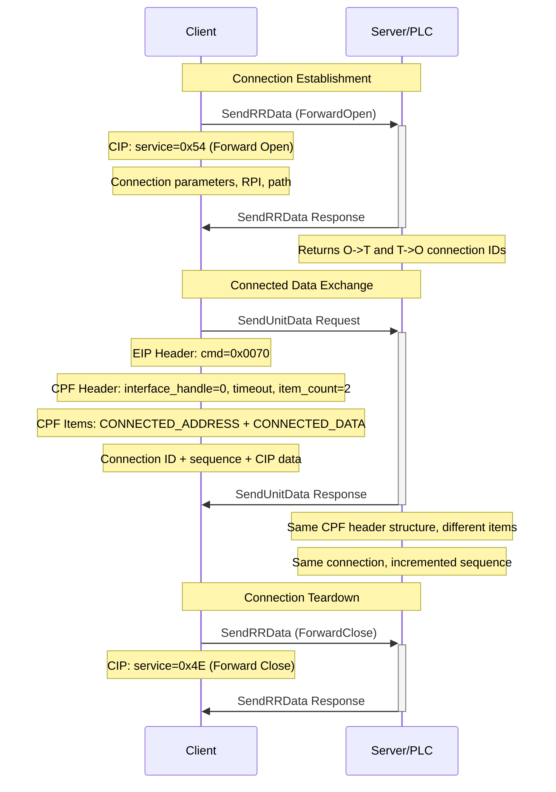
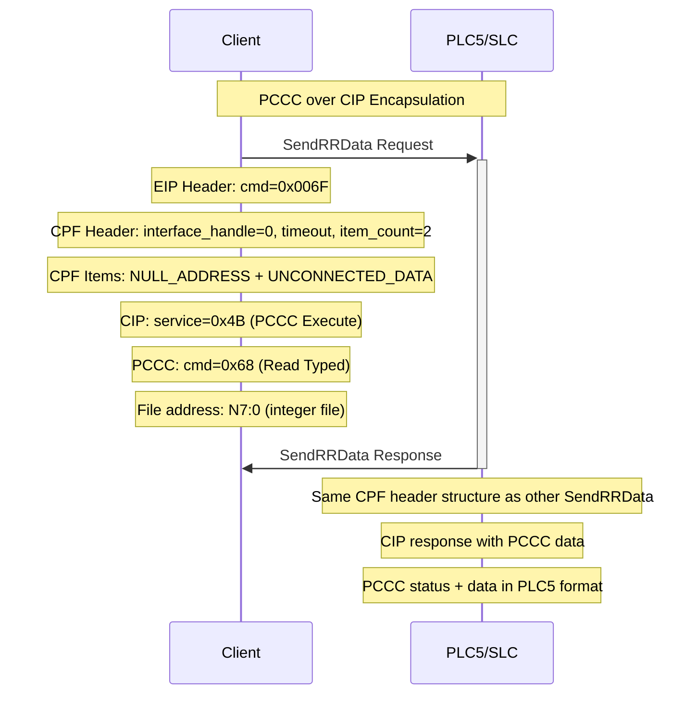

# EtherNet/IP and CIP Protocol Reference

## Overview

This document provides a comprehensive reference for the EtherNet/IP (Ethernet Industrial Protocol) and CIP (Common Industrial Protocol) implementation, including protocol structures, packet flows, and simulator capabilities. The ab_server implementation simulates various Rockwell Automation PLCs including PLC5 systems with support for both modern CIP commands and legacy PCCC/DF1 encapsulation.

## Protocol Stack

```
┌─────────────────────────────────────┐
│           Application Layer         │
│    (Tag Read/Write, PCCC, etc.)     │
├─────────────────────────────────────┤
│             CIP Layer              │
│  (Services, Objects, Attributes)    │
├─────────────────────────────────────┤
│     Common Packet Format (CPF)     │
│    (Connected/Unconnected Data)     │
├─────────────────────────────────────┤
│        EtherNet/IP Layer           │
│      (Encapsulation Header)         │
├─────────────────────────────────────┤
│             TCP Layer              │
│          (Port 44818)              │
├─────────────────────────────────────┤
│           Ethernet/IP              │
└─────────────────────────────────────┘
```

## Protocol Structures (C-Style)

### EtherNet/IP Encapsulation Layer

```c
/**
 * EtherNet/IP Encapsulation Header
 * All fields are little-endian unless specified
 */
typedef struct __attribute__((packed)) {
    uint16_t command;           // EIP command (ListIdentity=0x0063, RegisterSession=0x0065, etc.)
    uint16_t length;            // Length of data following this header
    uint32_t session_handle;    // Session identifier (0 for unregistered commands)
    uint32_t status;            // Status code (0 = success)
    uint64_t sender_context;    // Echo data for request/response matching
    uint32_t options;           // Options flags (typically 0)
} eip_encap_header_t;

/**
 * EIP Command Codes
 */
#define EIP_CMD_NOP                 0x0000
#define EIP_CMD_LIST_SERVICES       0x0001
#define EIP_CMD_LIST_IDENTITY       0x0063
#define EIP_CMD_LIST_INTERFACES     0x0064
#define EIP_CMD_REGISTER_SESSION    0x0065
#define EIP_CMD_UNREGISTER_SESSION  0x0066
#define EIP_CMD_SEND_RR_DATA        0x006F  // Unconnected messaging
#define EIP_CMD_SEND_UNIT_DATA      0x0070  // Connected messaging

/**
 * Register Session Request/Response
 */
typedef struct __attribute__((packed)) {
    uint16_t protocol_version;  // Always 1
    uint16_t options;          // Typically 0
} eip_register_session_t;

/**
 * List Identity Response Item
 */
typedef struct __attribute__((packed)) {
    uint16_t item_type;                    // 0x000C for Identity
    uint16_t item_length;                  // Length of following data
    uint16_t encapsulation_protocol_version; // Little-endian
    int16_t  sin_family;                   // Big-endian (AF_INET = 2)
    uint16_t sin_port;                     // Big-endian (44818)
    uint8_t  sin_addr[4];                  // IP address in network byte order (big-endian)
                                           // Example: 192.168.1.100 = {192, 168, 1, 100}
    uint8_t  sin_zero[8];                  // Padding
    uint16_t vendor_id;                    // Little-endian (1=Rockwell)
    uint16_t device_type;                  // Little-endian (14=PLC, 12=Comm Adapter)
    uint16_t product_code;                 // Little-endian
    uint8_t  revision_major;               // Major revision
    uint8_t  revision_minor;               // Minor revision
    uint16_t status;                       // Device status bitfield
    uint32_t serial_number;                // Device serial number
    uint8_t  product_name_len;             // Length of product name
    char     product_name[];               // Product name string
    uint8_t  state;                        // Device state
} eip_identity_item_t;

/**
 * Device Status Bitfield
 */
typedef struct __attribute__((packed)) {
    uint16_t owned : 1;                    // Bit 0: Device owned by master
    uint16_t reserved_1 : 1;               // Bit 1: Reserved
    uint16_t configured : 2;               // Bits 2-3: Configuration state
    uint16_t extended_device_status : 4;   // Bits 4-7: Extended status
    uint16_t minor_recoverable_fault : 1;  // Bit 8: Minor recoverable fault
    uint16_t minor_unrecoverable_fault : 1; // Bit 9: Minor unrecoverable fault
    uint16_t major_recoverable_fault : 1;  // Bit 10: Major recoverable fault
    uint16_t major_unrecoverable_fault : 1; // Bit 11: Major unrecoverable fault
    uint16_t reserved_12_15 : 4;           // Bits 12-15: Reserved
} eip_device_status_t;

#define EIP_CONFIGURED_NOT_CONFIGURED    0
#define EIP_CONFIGURED_CONFIGURED        1
#define EIP_CONFIGURED_INVALID          2
#define EIP_CONFIGURED_RESERVED         3
```

### Common Packet Format (CPF) Layer

```c
/**
 * Send RR Data (Unconnected Messaging) and Send Unit Data (Connected Messaging)
 * Both use identical header structure, differing only in CPF item contents
 */
typedef struct __attribute__((packed)) {
    uint32_t interface_handle;  // Always 0 for SendRRData, connection handle for SendUnitData
    uint16_t timeout;          // Request timeout in seconds
    uint16_t item_count;       // Number of CPF items (typically 2)
    // cpf_item_t items[item_count] follows
} eip_send_rr_data_t;

// SendUnitData uses same structure as SendRRData
typedef eip_send_rr_data_t eip_send_unit_data_t;

/**
 * CPF Item Header
 */
typedef struct __attribute__((packed)) {
    uint16_t item_type;    // CPF item type
    uint16_t item_length;  // Length of item data
    // uint8_t item_data[item_length] follows
} cpf_item_header_t;

/**
 * CPF Item Types
 */
#define CPF_TYPE_NULL_ADDRESS       0x0000
#define CPF_TYPE_LIST_IDENTITY      0x000C
#define CPF_TYPE_CONNECTION_BASED   0x00A1
#define CPF_TYPE_CONNECTED_DATA     0x00B1
#define CPF_TYPE_UNCONNECTED_DATA   0x00B2
#define CPF_TYPE_LIST_SERVICES      0x0100
#define CPF_TYPE_SOCKET_ADDRESS     0x8000

/**
 * Connected Address Item
 */
typedef struct __attribute__((packed)) {
    uint32_t connection_id;  // Connection identifier
} cpf_connected_address_t;

/**
 * Connected Data Item
 */
typedef struct __attribute__((packed)) {
    uint16_t connection_sequence;  // Sequence number
    // uint8_t cip_data[] follows
} cpf_connected_data_t;

/**
 * Unconnected Data Item contains raw CIP data
 */
```

### CIP (Common Industrial Protocol) Layer

```c
/**
 * CIP Request Header
 */
typedef struct __attribute__((packed)) {
    uint8_t service;              // CIP service code (0x01-0x7F)
    uint8_t request_path_size;    // Path size in 16-bit words
    // uint8_t request_path[request_path_size * 2] follows (padded to even bytes)
    // uint8_t service_data[] follows
} cip_request_t;

/**
 * CIP Response Header
 */
typedef struct __attribute__((packed)) {
    uint8_t service;                    // Service | 0x80 (response flag)
    uint8_t reserved;                   // Always 0
    uint8_t general_status;             // General status code
    uint8_t additional_status_size;     // Size of additional status in 16-bit words
    // uint16_t additional_status[additional_status_size] follows
    // uint8_t response_data[] follows
} cip_response_t;

/**
 * CIP Service Codes
 */
#define CIP_SERVICE_GET_ATTRIBUTES_ALL      0x01
#define CIP_SERVICE_SET_ATTRIBUTES_ALL      0x02
#define CIP_SERVICE_GET_ATTRIBUTE_SINGLE    0x0E
#define CIP_SERVICE_SET_ATTRIBUTE_SINGLE    0x10
#define CIP_SERVICE_MULTIPLE_SERVICE        0x0A
#define CIP_SERVICE_READ_TAG                0x4C
#define CIP_SERVICE_WRITE_TAG               0x4D
#define CIP_SERVICE_READ_TAG_FRAGMENTED     0x52
#define CIP_SERVICE_WRITE_TAG_FRAGMENTED    0x53
#define CIP_SERVICE_FORWARD_OPEN            0x54
#define CIP_SERVICE_FORWARD_CLOSE           0x4E
#define CIP_SERVICE_PCCC_EXECUTE            0x4B

/**
 * CIP Status Codes
 */
#define CIP_STATUS_SUCCESS                  0x00
#define CIP_STATUS_CONNECTION_FAILURE       0x01
#define CIP_STATUS_RESOURCE_UNAVAILABLE     0x02
#define CIP_STATUS_INVALID_PARAMETER        0x03
#define CIP_STATUS_PATH_SEGMENT_ERROR       0x04
#define CIP_STATUS_PATH_DESTINATION_UNKNOWN 0x05
#define CIP_STATUS_PARTIAL_TRANSFER         0x06
#define CIP_STATUS_CONNECTION_LOST          0x07
#define CIP_STATUS_SERVICE_NOT_SUPPORTED    0x08
#define CIP_STATUS_INVALID_ATTRIBUTE_VALUE  0x09
#define CIP_STATUS_ATTRIBUTE_LIST_ERROR     0x0A
#define CIP_STATUS_ALREADY_IN_REQUESTED_MODE 0x0B
#define CIP_STATUS_OBJECT_STATE_CONFLICT    0x0C
#define CIP_STATUS_OBJECT_ALREADY_EXISTS    0x0D
#define CIP_STATUS_ATTRIBUTE_NOT_SETTABLE   0x0E
#define CIP_STATUS_PRIVILEGE_VIOLATION      0x0F
#define CIP_STATUS_DEVICE_STATE_CONFLICT    0x10
#define CIP_STATUS_REPLY_DATA_TOO_LARGE     0x11
#define CIP_STATUS_FRAGMENTATION_PRIMITIVE  0x12
#define CIP_STATUS_NOT_ENOUGH_DATA          0x13
#define CIP_STATUS_ATTRIBUTE_NOT_SUPPORTED  0x14
#define CIP_STATUS_TOO_MUCH_DATA            0x15
#define CIP_STATUS_OBJECT_DOES_NOT_EXIST    0x16
#define CIP_STATUS_SERVICE_FRAGMENTATION    0x17
#define CIP_STATUS_NO_STORED_ATTRIBUTE_DATA 0x18
#define CIP_STATUS_STORE_OPERATION_FAILURE  0x19
#define CIP_STATUS_ROUTING_FAILURE          0x1A
#define CIP_STATUS_ROUTING_FAILURE_BAD_SIZE 0x1B
#define CIP_STATUS_ROUTING_FAILURE_BAD_FORMAT 0x1C
#define CIP_STATUS_INVALID_PARAMETER_SIZE   0x1D
#define CIP_STATUS_EXTENDED_ERROR           0xFF

/**
 * CIP Path Segment Types
 */
#define CIP_SEGMENT_TYPE_PORT        0x00  // Port segment
#define CIP_SEGMENT_TYPE_LOGICAL     0x20  // Logical segment
#define CIP_SEGMENT_TYPE_NETWORK     0x40  // Network segment
#define CIP_SEGMENT_TYPE_SYMBOLIC    0x60  // Symbolic segment
#define CIP_SEGMENT_TYPE_DATA        0x80  // Data segment

/**
 * Logical Segment Types
 */
#define CIP_LOGICAL_TYPE_CLASS       0x00  // Class ID
#define CIP_LOGICAL_TYPE_INSTANCE    0x04  // Instance ID
#define CIP_LOGICAL_TYPE_MEMBER      0x08  // Member ID (attribute)
#define CIP_LOGICAL_TYPE_CONNECTION  0x0C  // Connection point
#define CIP_LOGICAL_TYPE_ELEMENT     0x10  // Array element
#define CIP_LOGICAL_TYPE_SPECIAL     0x18  // Special

/**
 * CIP Data Types
 */
#define CIP_TYPE_BOOL     0xC1  // Boolean (16-bit for OMRON, see also 0xD3 for Rockwell)
#define CIP_TYPE_SINT     0xC2  // 8-bit signed integer
#define CIP_TYPE_INT      0xC3  // 16-bit signed integer
#define CIP_TYPE_DINT     0xC4  // 32-bit signed integer
#define CIP_TYPE_LINT     0xC5  // 64-bit signed integer
#define CIP_TYPE_USINT    0xC6  // 8-bit unsigned integer
#define CIP_TYPE_UINT     0xC7  // 16-bit unsigned integer
#define CIP_TYPE_UDINT    0xC8  // 32-bit unsigned integer
#define CIP_TYPE_ULINT    0xC9  // 64-bit unsigned integer
#define CIP_TYPE_REAL     0xCA  // 32-bit IEEE 754 float
#define CIP_TYPE_LREAL    0xCB  // 64-bit IEEE 754 double
#define CIP_TYPE_STRING   0xD0  // CIP STRING type
#define CIP_TYPE_BYTE     0xD1  // 8-bit unsigned integer (used as bit string)
#define CIP_TYPE_WORD     0xD2  // 16-bit unsigned integer (used as bit string)
#define CIP_TYPE_DWORD    0xD3  // 32-bit unsigned integer (used as bit string, Rockwell BOOL arrays)
#define CIP_TYPE_LWORD    0xD4  // 64-bit unsigned integer (used as bit string)

/**
 * Tag Read Request
 */
typedef struct __attribute__((packed)) {
    uint16_t element_count;  // Number of elements to read (1 for single)
    // Tag path follows based on request_path in CIP header
} cip_read_tag_request_t;

/**
 * Tag Write Request
 */
typedef struct __attribute__((packed)) {
    uint16_t data_type;      // CIP data type
    uint16_t element_count;  // Number of elements to write
    // uint8_t data[] follows
} cip_write_tag_request_t;

/**
 * Boolean Array Handling
 *
 * CIP data types 0xD1-0xD4 are unsigned integers used as bit strings for boolean arrays.
 * Different PLC vendors pack boolean arrays differently:
 *
 * - Rockwell (Allen-Bradley): Uses 0xD3 (DWORD/32-bit) packing
 *   - Each DWORD contains 32 boolean values
 *   - Bit 0 = LSB, Bit 31 = MSB
 *   - Array[0-31] maps to bits 0-31 of first DWORD
 *   - Array[32-63] maps to bits 0-31 of second DWORD, etc.
 *
 * - OMRON: Uses 0xC1 (8-bit booleans) packing it into 32-bit words
 *   - Each WORD contains 16 boolean values
 *   - Bit 0 = LSB, Bit 15 = MSB
 *   - Array[0-15] maps to bits 0-15 of first WORD
 *   - Array[16-31] maps to bits 0-15 of second WORD, etc.
 *   - Data is sent as 16-bit unsigned integers (similar to 0xD2 format)
 */

/**
 * Forward Open Request
 */
typedef struct __attribute__((packed)) {
    uint8_t  secs_per_tick;              // Timing tick base
    uint8_t  timeout_ticks;              // Connection timeout multiplier
    uint32_t server_conn_id;             // O->T connection ID (set by server)
    uint32_t client_conn_id;             // T->O connection ID (set by client)
    uint16_t conn_serial_number;         // Connection serial number
    uint16_t orig_vendor_id;             // Originator vendor ID
    uint32_t orig_serial_number;         // Originator serial number
    uint8_t  conn_timeout_multiplier;    // Connection timeout multiplier
    uint8_t  reserved[3];                // Reserved bytes
    uint32_t client_to_server_rpi;       // Requested packet interval (O->T)
    uint16_t client_to_server_params;    // Connection parameters (O->T)
    uint32_t server_to_client_rpi;       // Requested packet interval (T->O)
    uint16_t server_to_client_params;    // Connection parameters (T->O)
    uint8_t  transport_class;            // Transport class (0xA3 = connected)
    uint8_t  connection_path_size;       // Connection path size in words
    // uint8_t connection_path[connection_path_size * 2] follows
} cip_forward_open_request_t;
```

### PCCC (Programmable Controller Communication Commands) Layer

```c
/**
 * PCCC Execute Request (for legacy PLC5 support)
 */
typedef struct __attribute__((packed)) {
    uint8_t  pccc_command;        // PCCC command code
    uint8_t  pccc_status;         // PCCC status (0 for request)
    uint16_t pccc_transaction_id; // Transaction identifier
    // uint8_t pccc_data[] follows
} cip_pccc_execute_request_t;

/**
 * PCCC Command Codes
 */
#define PCCC_CMD_READ_TYPED         0x68
#define PCCC_CMD_WRITE_TYPED        0x67
#define PCCC_CMD_READ_MODIFY_WRITE  0x69

/**
 * PCCC File Address
 */
typedef struct __attribute__((packed)) {
    uint8_t  file_type;      // File type (N=7, B=3, T=4, C=5, R=6, etc.)
    uint8_t  file_number;    // File number
    uint16_t element_number; // Element within file
    uint8_t  sub_element;    // Sub-element (bit number for bit files)
} pccc_file_address_t;

/**
 * PCCC Data Types
 */
#define PCCC_TYPE_BIT        0x01
#define PCCC_TYPE_BIT_STRING 0x03
#define PCCC_TYPE_BYTE       0x02
#define PCCC_TYPE_INTEGER    0x89
#define PCCC_TYPE_FLOAT      0x8A
#define PCCC_TYPE_BCD        0x87
#define PCCC_TYPE_STRING     0x8D

/**
 * PLC5 String Format (82 bytes, byte-swapped pairs)
 */
typedef struct __attribute__((packed)) {
    uint16_t length;     // String length (max 82)
    char     data[82];   // String data with byte-swapped pairs
} plc5_string_t;
```

## Packet Flow Diagrams

### 1. Device Discovery Flow



### 2. Session Establishment Flow



### 3. Unconnected Tag Read Flow



### 4. Connected Messaging Flow



### 5. PCCC/DF1 Legacy Communication Flow




#### Boolean Array Examples:

```c
// Rockwell ControlLogix BOOL array (32-bit packing)
// Array[0-31] stored in first DWORD, Array[32-63] in second DWORD
uint32_t bool_array_data[2] = {
    0x00000001,  // Array[0] = true, Array[1-31] = false
    0x80000000   // Array[32-62] = false, Array[63] = true
};

// OMRON BOOL array (16-bit packing transmitted as 16-bit words)
// Array[0-15] stored in first WORD, Array[16-31] in second WORD
uint16_t bool_array_data[2] = {
    0x0001,  // Array[0] = true, Array[1-15] = false
    0x8000   // Array[16-30] = false, Array[31] = true
};
```

## Implementation Notes

### Endianness Handling

- **EIP Headers**: Little-endian except for socket address fields
- **CIP Data**: Little-endian for all data types
- **PCCC Data**: PLC5 format with byte-swapped word pairs for floats and strings
- **Network Addresses**: Big-endian in socket address fields

### Connection Management

- **Session Handles**: 32-bit identifiers for EIP sessions
- **Connection IDs**: 32-bit identifiers for CIP connections
- **Sequence Numbers**: 16-bit rolling counters for connected data

### Error Handling

The server implements comprehensive error responses:

- **EIP Status Codes**: Invalid command, invalid length, invalid session
- **CIP General Status**: Service not supported, path segment error, attribute not found
- **PCCC Status Codes**: Invalid file, invalid element, protection violation

### Security Considerations

- **No Authentication**: Basic implementation with no security
- **Path Validation**: Validates CIP paths and file addresses
- **Resource Limits**: Prevents excessive connections and data requests

## Testing and Validation

### Test Scenarios

1. **Device Discovery**: Verify ListIdentity responses
2. **Session Management**: Test session registration/unregistration
3. **Tag Operations**: Read/write various data types
4. **Connection Handling**: Connected vs unconnected messaging
5. **PCCC Compatibility**: Legacy PLC5/SLC communication
6. **Error Conditions**: Invalid requests, malformed packets

### Client Tools

Compatible with standard EtherNet/IP clients:

- **RSLinx Classic**: Rockwell's communication software
- **libplctag**: Open-source PLC communication library
- **pycomm3**: Python EtherNet/IP library
- **Custom clients** using this protocol reference

## References

- ODVA EtherNet/IP Specification
- Rockwell Automation PLC-5 Programming Manual
- CIP Specification Volume 1 & 2
- PCCC Communication Protocol Documentation

---

*This documentation serves as a comprehensive reference for understanding and implementing EtherNet/IP and CIP communication protocols, particularly for simulation and testing scenarios.*
