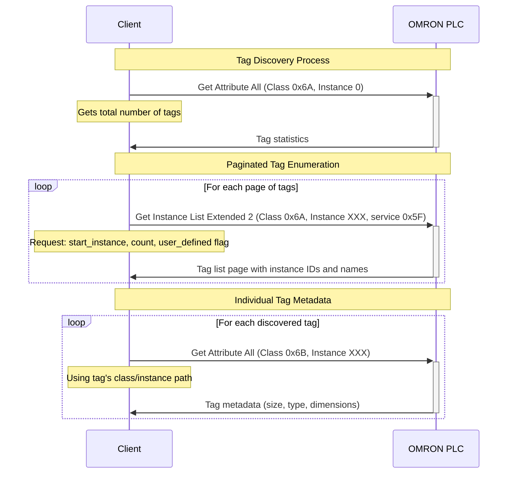
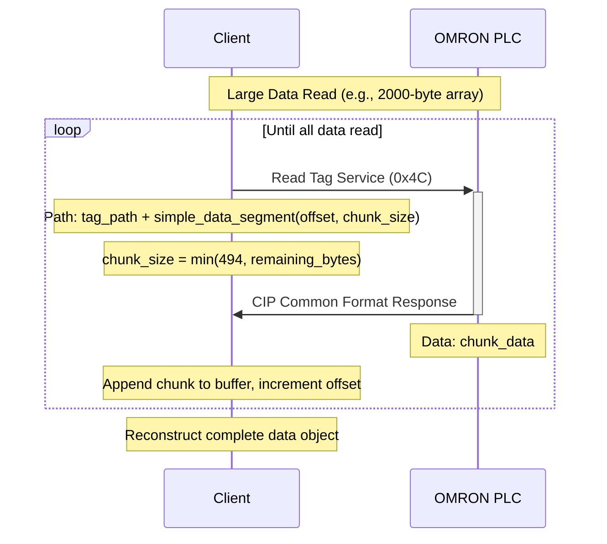
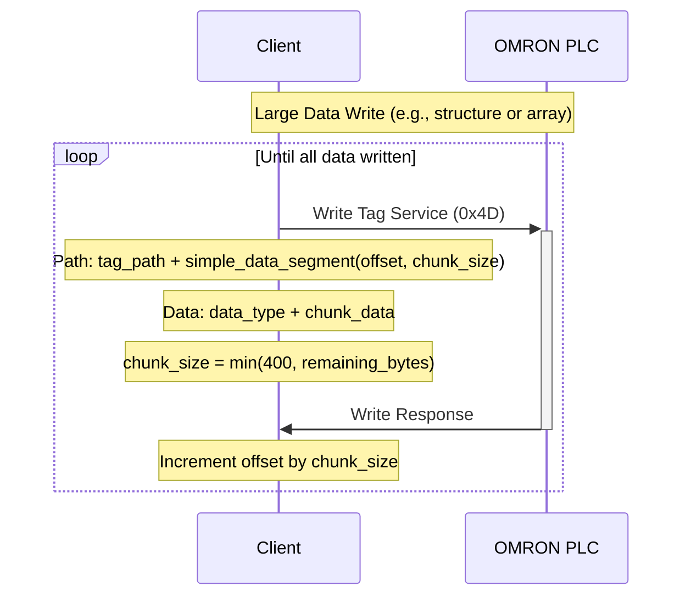

# OMRON CIP Protocol Reference

## Overview

This document outlines the OMRON-specific CIP protocol extensions and implementation patterns discovered in the aphytcomm Python library. OMRON PLCs implement vendor-specific CIP services and object classes that extend the standard CIP protocol for tag enumeration, data type discovery, and large data transfer operations.

## OMRON-Specific CIP Extensions

### Vendor-Specific Object Classes

OMRON implements several proprietary CIP object classes for advanced tag and data type management:

#### 1. Tag Definition Object (Class 0x6A)
- **Purpose**: Manages tag enumeration and provides tag metadata
- **Instance 0/class**: Contains global tag information
- **Services**:
  - Get Attribute All (0x01): Returns tag server statistics
  - Get Instance List Extended 2 (0x5F): Returns paginated tag lists

#### 2. User Defined Type Object (Class 0x6B)
- **Purpose**: Describes individual user defined aggregate instances and their properties
- **Services**:
  - Get Attribute All (0x01): Returns variable metadata including size, data type, array dimensions

#### 3. User Defined Type Definition Object (Class 0x6C)
- **Purpose**: Defines data type templates and structure definitions
- **Services**:
  - Get Attribute All (0x01): Returns type definition including member layout, CRC codes

### OMRON-Specific Data Types

OMRON extends the standard CIP data types with vendor-specific codes:

```c
// OMRON Vendor-Specific Data Types
#define OMRON_ENUM          0x07    // Enumeration (4-byte)
#define OMRON_DATE_NSEC     0x08    // Date with nanosecond precision
#define OMRON_TIME_NSEC     0x09    // Time with nanosecond precision
#define OMRON_DATE_TIME_NSEC 0x0A   // Date/Time with nanosecond precision
#define OMRON_TIME_OF_DAY_NSEC 0x0B // Time of day with nanosecond precision
#define OMRON_UNION         0x0C    // Union data type
#define OMRON_UINT_BCD      0x04    // 1-word unsigned BCD
#define OMRON_UDINT_BCD     0x05    // 2-word unsigned BCD
#define OMRON_ULINT_BCD     0x06    // 4-word unsigned BCD
```

## Tag Enumeration Process

### 1. Discovery Flow

The aphytcomm library implements a multi-step process for discovering all tags:



### 2. Get Instance List Extended 2 Service (0x5F)

This OMRON-specific service returns paginated lists of tag instances:

**Request Format:**
```c
typedef struct __attribute__((packed)) {
    uint32_t start_instance_id;     // Starting instance ID (1-based)
    uint32_t number_of_instances;   // Max instances to return (typically 100)
    uint16_t kind_of_variable;      // 1=system, 2=user-defined
} omron_get_instance_list_request_t;
```

**Response Format:**
```c
typedef struct __attribute__((packed)) {
    uint16_t instance_count;        // Number of instances returned
    uint8_t  more_available;        // 0=last page, 1=more data available
    uint8_t  reserved;
    // Variable-length instance data follows
} omron_get_instance_list_response_t;

typedef struct __attribute__((packed)) {
    uint16_t data_length;           // Length of this instance data
    uint16_t class_id;              // CIP class ID (0x6B for variables)
    uint32_t instance_id;           // Variable instance ID
    uint8_t  tag_name_length;       // Length of tag name
    char     tag_name[];            // Variable-length tag name
} omron_instance_data_t;
```

### 3. Variable Object Metadata

Each tag's metadata is retrieved using Get Attribute All on the Variable Object:

```c
typedef struct __attribute__((packed)) {
    uint32_t size;                  // Total size in bytes
    uint8_t  cip_data_type;         // Primary CIP data type
    uint8_t  cip_data_type_of_array; // Array element type (if array)
    uint8_t  array_dimension;       // Number of array dimensions
    uint8_t  padding;               // Alignment padding
    uint32_t number_of_elements[];  // Elements per dimension (variable length)
    uint8_t  bit_number;            // Bit position (for BOOL types)
    uint8_t  padding2[3];           // More padding
    uint32_t variable_type_instance_id; // Reference to type definition
    uint32_t start_array_elements[]; // Array start indices (variable length)
} omron_variable_object_attributes_t;
```

## Large Data Transfer Mechanisms

### 1. Simple Data Segment Requests

OMRON uses a proprietary segmentation mechanism for reading/writing data larger than the 502-byte UCMM limit:

```c
/**
 * OMRON Simple Data Segment Request Path Extension
 */
typedef struct __attribute__((packed)) {
    uint8_t  segment_type;          // 0x80 (Simple Data Type)
    uint8_t  segment_length;        // 0x03 (fixed, in words)
    uint32_t offset;                // Byte offset into data
    uint16_t size;                  // Number of bytes to transfer
} omron_simple_data_segment_t;
```

### 2. Multi-Message Read Process

For data larger than ~502 bytes, the library implements chunked reading:



**Implementation Details:**
- Maximum chunk size: 494 bytes (502 - 8 bytes for CIP headers)
- Offset tracking: Byte-based addressing
- Data reconstruction: Concatenate chunks in order
- String handling: First 2 bytes indicate actual string length read

### 3. Multi-Message Write Process

Large data writes follow a similar chunked approach:



**Special Handling by Data Type:**

1. **CIP Strings (0xD0):**
   - Add 2-byte length prefix to each chunk
   - Length indicates actual data in chunk, not total string length

2. **CIP Structures (0xA0):**
   - Use Abbreviated Structure format (0xA1) for writes
   - Include 2-byte CRC code in additional info field
   - CRC obtained from Variable Type Object

3. **CIP Arrays (0xA2):**
   - For structure arrays: Use Abbreviated Structure format with CRC
   - For primitive arrays: Use element data type directly
   - Boolean arrays: Pack according to OMRON 16-bit word format

## Boolean Array Handling

OMRON PLCs handle boolean arrays differently from Rockwell PLCs:

### OMRON Boolean Array Format
- **Data Type**: 0xC1 (BOOL) but transmitted as 16-bit words
- **Packing**: 16 booleans per word (WORD packing)
- **Bit Order**: LSB = array[0], MSB = array[15]
- **Wire Format**: Sent as 0xD2 (WORD) data type

```c
// Example: BOOL array[25] on OMRON
// Requires 2 WORDs (32 bits total, 7 bits unused)
uint16_t bool_array_wire_data[2] = {
    0x0001,  // array[0]=true, array[1-15]=false
    0x0200   // array[16-24]=false, array[25]=true, array[26-31]=unused
};
```

### Read/Write Process for Boolean Arrays
1. **Read**: Receive as 16-bit words, unpack to individual boolean values
2. **Write**: Pack boolean values into 16-bit words, send as WORD data type
3. **Size Calculation**: `word_count = (bool_count + 15) / 16`

## Error Handling and Reliability

### Connection Management
The aphytcomm library implements robust connection handling:

1. **Session Persistence**: Maintains EIP session across operations
2. **Automatic Reconnection**: Detects connection failures and reconnects
3. **Keep-Alive**: Periodic List Services requests to maintain session
4. **Retry Logic**: Configurable retry attempts for failed operations

### Verified Write Operations
Critical writes use a read-back verification pattern:
```python
def verified_write_variable(self, variable_name, data, retry_count=2):
    remaining_retry = retry_count
    temp_data = None
    while remaining_retry >= 0 and temp_data != data:
        self.write_variable(variable_name, data)
        temp_data = self.read_variable(variable_name)
        remaining_retry -= 1
    if remaining_retry < 0 and temp_data != data:
        raise IOError('Write Operation could not be completed')
```

## Performance Optimizations

### 1. Dictionary Caching
- Tag metadata cached in memory after first discovery
- Persistent storage option to avoid re-enumeration
- User/System tag separation for filtering

### 2. Threading Support
- Thread-safe operations using executor pools
- Monitored variables with automatic refresh
- Observer pattern for real-time updates

### 3. Batch Operations
- Multiple tag operations in single requests where possible
- Chunked data transfer with optimal chunk sizing
- Connection pooling for multiple concurrent operations

## Wire Protocol Examples

### Tag Enumeration Request
```
EIP Encapsulation Header:
  Command: 0x006F (SendRRData)
  Length: 0x0016
  Session: <session_handle>
  Status: 0x00000000
  Sender Context: <context>
  Options: 0x00000000

CPF Items:
  Item 1: NULL Address (0x0000), Length: 0x0000
  Item 2: Unconnected Data (0x00B2), Length: 0x000A

CIP Request:
  Service: 0x5F (Get Instance List Extended 2)
  Path Size: 0x02 (words)
  Path: 0x20 0x6A 0x24 0x00 (Class 0x6A, Instance 0x00)
  Data:
    Start Instance: 0x00000001
    Instance Count: 0x00000064 (100)
    Variable Kind: 0x0002 (user-defined)
```

### Large Data Read Request
```
EIP Encapsulation Header:
  Command: 0x006F (SendRRData)

CIP Request:
  Service: 0x4C (Read Tag)
  Path Size: Variable
  Path: <symbolic_tag_path> + 0x80 0x03 <offset> <size>
  Data: 0x0001 (element count = 1)

Simple Data Segment:
  Segment Type: 0x80
  Length: 0x03 (words)
  Offset: 0x00000000 (first chunk)
  Size: 0x01EE (494 bytes)
```

## Implementation Notes

1. **Path Construction**: OMRON uses standard symbolic paths plus simple data segments for large data
2. **Endianness**: All multi-byte fields are little-endian except socket addresses
3. **String Handling**: OMRON strings include length prefixes and may require special chunking
4. **Structure CRCs**: Required for structure writes, obtained from Variable Type Objects
5. **Array Indexing**: Zero-based indexing with support for multi-dimensional arrays

## Comparison with Rockwell/Allen-Bradley CIP Implementation

### Tag Enumeration Mechanisms

#### OMRON Approach
- **Primary Method**: Get Instance List Extended 2 (Service 0x5F)
- **Object Classes**: Tag Name Server (0x6A), Variable Object (0x6B), Variable Type Object (0x6C)
- **Process**:
  1. Query Tag Name Server for total count
  2. Paginated retrieval of tag instances with names
  3. Individual metadata requests for each tag
- **Advantages**: Direct tag discovery, user/system filtering, complete metadata

#### Rockwell/Allen-Bradley Approach
- **Primary Method**: Get_Instance_Attribute_List (Service 0x55) on Symbol Object (Class 0x6B)
- **Object Classes**: Symbol Object (0x6B), Template Object (0x6C)
- **Process**:
  1. Query Symbol Object for instance list
  2. Batch attribute retrieval using service 0x55
  3. Parse packed attribute data for tag metadata
- **Advantages**: Batch operations, standard CIP services, integrated with Logix 5000 system

**Detailed Implementation:**

Rockwell uses a special "@tags" pseudo-tag that internally generates CIP requests against the Symbol Object (Class 0x6B):

```c
/* Rockwell Tag Listing CIP Request Format (Service 0x55) */
typedef struct __attribute__((packed)) {
    uint8_t  request_service;     // 0x55 (Get_Instance_Attribute_List)
    uint8_t  request_path_size;   // 3 words (6 bytes)
    uint8_t  request_path[6];     // Class 0x6B, Instance starting ID
    uint16_t num_attributes;      // 0x04 (number of attributes to get)
    uint16_t requested_attributes[4]; // Attribute IDs: 0x02, 0x07, 0x08, 0x01
} rockwell_tag_list_request_t;

/* Request path breakdown:
 * 0x20 - Get class
 * 0x6B - Symbol class (tag info)
 * 0x25 - Get instance (16-bit)
 * 0x00 - Padding
 * instance_id (16-bit LE) - Starting instance ID for enumeration
 */

/* Requested attributes:
 * 0x02 - Symbol type
 * 0x07 - Base type size (array element) in bytes
 * 0x08 - Array dimensions (3 x uint32)
 * 0x01 - Symbol name
 */

/* Wire-level example for controller tags starting at instance 0: */
// 55 03 20 6B 25 00 00 00 04 00 02 00 07 00 08 00 01 00
```

**UDT Definition Retrieval:**

Rockwell uses a two-step process for UDT introspection:

1. **UDT Metadata** (Template Object Class 0x6C, Service 0x03):
```c
/* UDT Metadata Request */
typedef struct __attribute__((packed)) {
    uint8_t  request_service;     // 0x03 (Get_Attribute_List)
    uint8_t  request_path_size;   // 3 words (6 bytes)
    uint8_t  request_path[6];     // Class 0x6C, UDT instance
    uint16_t num_attributes;      // 0x04 (4 attributes)
    uint16_t attributes[4];       // 0x04, 0x05, 0x02, 0x01
} rockwell_udt_metadata_request_t;

/* Request path: 0x20 0x6C 0x25 0x00 [udt_id_le] */
/* Attributes: 0x04=field_def_size, 0x05=struct_size, 0x02=num_members, 0x01=handle */
```

2. **UDT Field Data** (Template Object Class 0x6C, Service 0x4C):
```c
/* UDT Field Data Request */
typedef struct __attribute__((packed)) {
    uint8_t  request_service;     // 0x4C (Read)
    uint8_t  request_path_size;   // 3 words (6 bytes)
    uint8_t  request_path[6];     // Class 0x6C, UDT instance
    uint32_t offset;              // Byte offset for fragmented reads
    uint16_t read_size;           // Number of bytes to read
} rockwell_udt_field_request_t;

/* Read size calculation: (field_def_size * 4) - 23, rounded to 4-byte boundary */
```

**Response Format:**

```c
/* Each tag entry in the response */
typedef struct __attribute__((packed)) {
    uint32_t instance_id;         // Monotonically increasing instance ID
    uint16_t symbol_type;         // Type of the symbol
    uint16_t element_length;      // Length of one array element in bytes
    uint32_t array_dims[3];       // Array dimensions
    uint16_t string_len;          // String length count
    uint8_t  string_data[];       // String bytes (string_len of them)
} rockwell_tag_entry_t;
```

**Program Tag Enumeration:**

For program-scoped tags, Rockwell uses symbolic path addressing:

```c
/* Program tag request adds symbolic segment before class/instance */
typedef struct __attribute__((packed)) {
    uint8_t  request_service;     // 0x55
    uint8_t  request_path_size;   // Variable length
    uint8_t  symbolic_header;     // 0x91 (Symbolic segment)
    uint8_t  name_length;         // Program name length
    uint8_t  program_name[];      // e.g., "PROGRAM:MainProgram"
    // Optional padding if program name is odd length
    uint8_t  class_path[6];       // Standard class 0x6B, instance 0x00
    uint16_t num_attributes;      // 0x04
    uint16_t requested_attributes[4]; // Same as controller tags
} rockwell_program_tag_request_t;
```

**User Defined Types (UDT) Discovery:**

Rockwell provides a special "@udt/{id}" pseudo-tag format for UDT introspection:

```c
/* UDT Definition Request */
// Use tag name: "@udt/123" where 123 is the UDT ID

/* UDT Definition Response Format */
typedef struct __attribute__((packed)) {
    uint16_t template_id;         // UDT ID (should match requested ID)
    uint32_t member_desc_size;    // Member description size in 32-bit words
    uint32_t udt_instance_size;   // UDT instance size in bytes
    uint16_t num_members;         // Number of fields/members
    uint16_t struct_handle;       // UDT handle/type
    // Variable-length field data follows
} rockwell_udt_header_t;

/* Field information structure */
typedef struct __attribute__((packed)) {
    uint16_t field_metadata;      // Array element count or bit field number
    uint16_t field_type;          // CIP data type
    uint32_t field_offset;        // Offset within structure
} rockwell_udt_field_info_t;

/* After field info:
 * - UDT name (zero-terminated string, name stops at first semicolon)
 * - Field names (N zero-terminated strings)
 */
```

**Type System Details:**

```c
/* Rockwell Type Flags */
#define TYPE_IS_STRUCT    0x8000    // Structure/UDT type
#define TYPE_IS_SYSTEM    0x1000    // System-defined type
#define TYPE_DIM_MASK     0x6000    // Array dimension mask
#define TYPE_UDT_ID_MASK  0x0FFF    // UDT ID mask

/* Array dimension extraction */
#define GET_ARRAY_DIMS(type)  (((type) & TYPE_DIM_MASK) >> 13)
#define GET_UDT_ID(type)      ((type) & TYPE_UDT_ID_MASK)
```

#### Rockwell Structure Operations
- **Write Format**: Structure handle or member-by-member access
- **Template System**: Template Object (Class 0x6C) for definitions
- **Validation**: Template-based type checking
- **Member Access**: Direct symbolic addressing (e.g., "MyStruct.Member")

**UDT Discovery and Caching:**

Rockwell PLCs support comprehensive UDT introspection through the "@udt/{id}" mechanism:

```c
/* UDT Processing Implementation */
struct udt_entry_s {
    char *name;                      // UDT name (truncated at semicolon)
    uint16_t id;                     // UDT template ID
    uint16_t num_fields;             // Number of fields
    uint16_t struct_handle;          // Structure handle
    uint32_t instance_size;          // Instance size in bytes
    struct udt_field_entry_s fields[]; // Field definitions
};

struct udt_field_entry_s {
    char *name;                      // Field name
    uint16_t type;                   // CIP data type
    uint16_t metadata;               // Array count or bit number
    uint32_t size;                   // Field size in bytes
    uint32_t offset;                 // Offset within structure
};
```

**UDT Name Processing:**

```c
/* UDT names are stored with additional metadata after semicolon */
void process_udt_name(char *raw_name) {
    for (int i = 0; raw_name[i] != '\0'; i++) {
        if (raw_name[i] == ';') {
            raw_name[i] = '\0';  // Truncate at semicolon
            break;
        }
    }
}
```

**Micro800 vs ControlLogix Differences:**

The libplctag source shows subtle differences between Rockwell PLC families:

```c
/* ControlLogix uses full path specification */
#define CONTROLLOGIX_TEMPLATE "protocol=ab-eip&gateway=%s&path=%s&plc=ControlLogix&name="

/* Micro800 uses simplified path */
#define MICRO800_TEMPLATE "protocol=ab-eip&gateway=%s&plc=Micro800&name="
```

**Tag String Construction:**

```c
/* ControlLogix tag string format */
sprintf(tag_string,
    "protocol=ab-eip&gateway=%s&path=%s&plc=ControlLogix&elem_size=%u&elem_count=%u&name=%s",
    host, path, elem_size, elem_count, tag_name);

/* Program-scoped tags */
sprintf(tag_string,
    "protocol=ab-eip&gateway=%s&path=%s&plc=ControlLogix&elem_size=%u&elem_count=%u&name=%s.%s",
    host, path, elem_size, elem_count, program_name, tag_name);
```

### Summary

OMRON's CIP implementation provides more advanced features for tag discovery and robust connection management, while Rockwell follows a more standard CIP approach with better interoperability. The key differences in boolean array packing, large data transfer mechanisms, and tag enumeration services make the implementations largely incompatible at the protocol level, requiring vendor-specific client implementations.

**Key Implementation Insights from libplctag:**

1. **Pseudo-Tag Mechanism**: Rockwell uses special pseudo-tags (@tags, @udt/{id}) that internally generate appropriate CIP requests
2. **Batch Processing**: Service 0x55 allows efficient batch retrieval of tag metadata
3. **Hierarchical Structure**: Program tags use symbolic path prefixes for scope isolation
4. **UDT Introspection**: Comprehensive structure definition retrieval with field names and offsets
5. **Type System**: Rich type flags for arrays, structures, and built-in types
6. **String Handling**: Multiple string formats (0xDA, 0xDB, 0xD0) with different length encodings

**Protocol-Level Comparison Summary:**

| Feature              | OMRON                                           | Rockwell/Allen-Bradley          |
| -------------------- | ----------------------------------------------- | ------------------------------- |
| **Discovery Method** | Service 0x5F paginated                          | Service 0x55 batch attributes   |
| **Object Classes**   | 0x6A (Tag Server), 0x6B (Variable), 0x6C (Type) | 0x6B (Symbol), 0x6C (Template)  |
| **Large Data**       | Simple Data Segments (0x80)                     | Fragmented Services (0x52/0x53) |
| **Boolean Packing**  | 16-bit words                                    | 32-bit words                    |
| **UDT Access**       | Variable Type Object                            | @udt/{id} pseudo-tag            |
| **Program Scoping**  | Not documented                                  | Symbolic path prefixes          |
| **String Types**     | Extended with length prefixes                   | Multiple CIP string formats     |
| **Type Flags**       | Vendor-specific extensions                      | Standard CIP with bit flags     |
